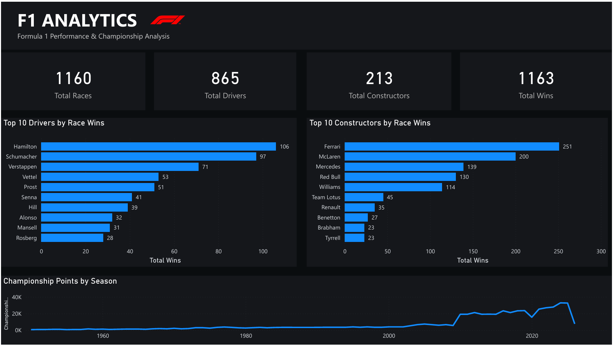
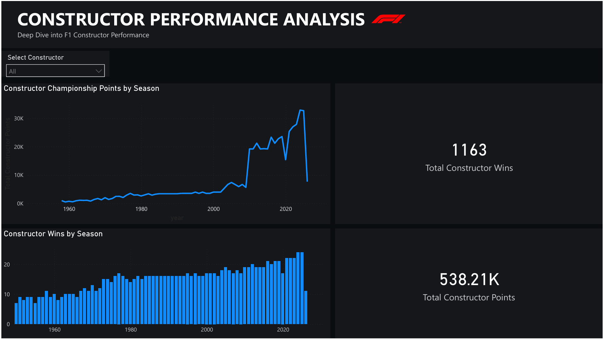
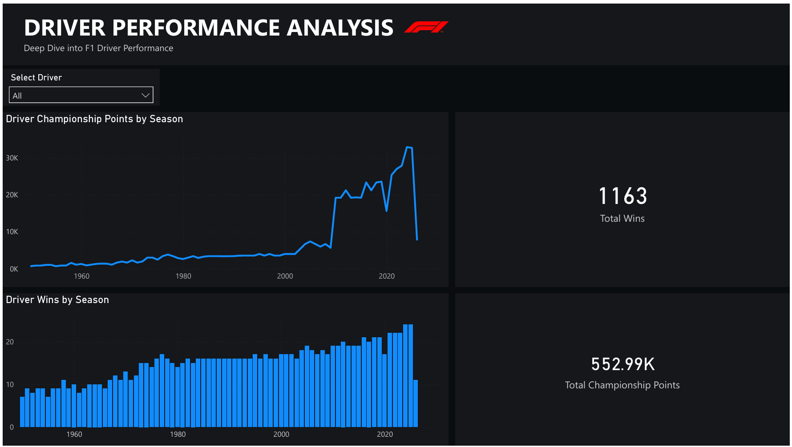

# F1 Analytics Dashboard

Formula 1 Performance and Championship Analysis using SQL, Power BI and DAX.

## Dashboard

### Page 1 - F1 Analytics

### Page 2 - Driver Performance Analysis

### Page 3 - Constructor Performance Analysis

## Tools Used

- SQL
- Power BI
- DAX
- Python
- Jupyter Notebook
- Git and GitHub

## Project Features

- Driver performance analysis
- Constructor performance analysis
- Championship points analysis
- Race wins analysis
- Season-wise performance trends
- Interactive driver slicer
- Interactive constructor slicer
- Dynamic KPI cards

## Project Files

- powerbi/F1_Analytics.pbix - Power BI dashboard
- powerbi/F1_Analytics.pdf - Dashboard PDF
- data/ - Raw and cleaned datasets
- notebooks/ - Data cleaning and analysis notebooks
- sql/ - SQL analysis scripts
- screenshots/ - Dashboard screenshots

## Author

Sanidhya Sharma
